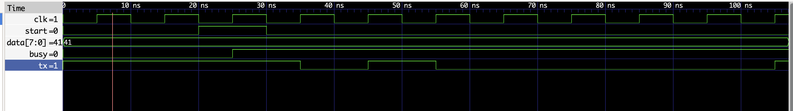

# UART Transmitter in Verilog

This project implements a **UART (Universal Asynchronous Receiver/Transmitter) transmitter** using Verilog HDL.
The design sends an **8-bit data frame** over a serial line following the standard UART protocol.

The project also includes a **testbench for simulation** and **waveform verification using GTKWave**.

---

# Project Structure

```
uart-verilog
│
├── src
│   └── uart_tx.v        # UART transmitter RTL design
│
├── tb
│   └── uart_tb.v        # Testbench for simulation
│
├── waveform
│   └── uart_waveform.png # Simulation waveform screenshot
│
├── README.md
└── .gitignore
```

---

# UART Frame Format

The UART transmitter sends data in the following format:

```
| Start |  Data[0] ... Data[7] | Stop |
|   0   |     8 data bits      |  1   |
```

Explanation:

* **Idle line** : logic `1`
* **Start bit** : logic `0`
* **Data bits** : transmitted **LSB first**
* **Stop bit** : logic `1`

Example transmission for data **0x41 (ASCII 'A')**:

```
Start  Data bits (LSB → MSB)     Stop
  0      1 0 0 0 0 0 1 0          1
```

---

# Design Overview

The transmitter operates using a **Finite State Machine (FSM)**.

States:

```
IDLE
  ↓
START
  ↓
DATA (8 bits)
  ↓
STOP
  ↓
IDLE
```

Signal description:

| Signal    | Description                          |
| --------- | ------------------------------------ |
| clk       | System clock                         |
| start     | Trigger signal to start transmission |
| data[7:0] | Input data to transmit               |
| tx        | Serial output line                   |
| busy      | Indicates transmission in progress   |

---

# Simulation

Simulation is performed using **Icarus Verilog** and **GTKWave**.

Compile:

```
iverilog -o uart_tb tb/uart_tb.v src/uart_tx.v
```

Run simulation:

```
vvp uart_tb
```

Open waveform:

```
gtkwave uart.vcd
```

---

# Simulation Result

The waveform below shows the UART transmission of data **0x41**.

* Start bit
* 8 data bits (LSB first)
* Stop bit



---

# Tools Used

* Verilog HDL
* Icarus Verilog
* GTKWave
* Git & GitHub

---

# Author

Ho Minh Thao
Electronics and Telecommunications Engineering Student

---

# License

This project is open-source and available for learning and educational purposes.
