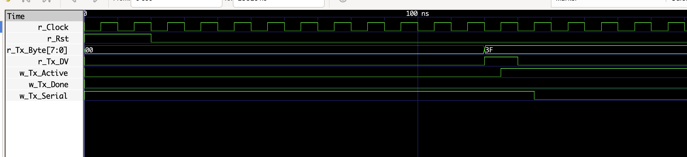
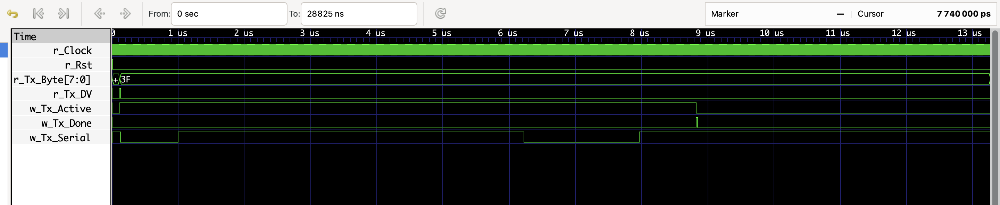

# UART Transmitter in Verilog

## Overview

This project implements a **UART (Universal Asynchronous Receiver Transmitter) Transmitter** using Verilog HDL.
The design is based on a **Finite State Machine (FSM)** that serializes an 8-bit parallel input and transmits it through a UART serial interface.

The transmitter follows the standard UART frame format with:

* **1 Start bit**
* **8 Data bits (LSB first)**
* **1 Stop bit**

The design has been verified using **Icarus Verilog** for simulation and **GTKWave** for waveform visualization.

---

## Features

* FSM-based UART transmitter
* Parameterizable baud rate using `CLKS_PER_BIT`
* 8-bit parallel-to-serial data transmission
* Start bit and stop bit handling
* Simulation testbench included
* Verified waveform output

---

## UART Frame Format

| Idle | Start Bit | Data Bits (8-bit) | Stop Bit |
| ---- | --------- | ----------------- | -------- |
| 1    | 0         | LSB first         | 1        |

Example transmission for byte `0x3F`:

```
Idle  Start   Data Bits (LSB first)      Stop
 1      0      1 1 1 1 1 1 0 0             1
```

---

## Block Diagram

```
        +------------------+
data -->|                  |
start ->|     UART TX      |--> tx_serial
clock ->|                  |
        +------------------+
```

The transmitter converts parallel input data into a serial UART stream.

---

## Finite State Machine

The UART transmitter is implemented using a **Finite State Machine (FSM)** with the following states:

```
IDLE
 ↓
START_BIT
 ↓
DATA_BITS
 ↓
STOP_BIT
 ↓
CLEANUP
 ↓
IDLE
```

### State Description

| State     | Description                             |
| --------- | --------------------------------------- |
| IDLE      | Wait for data valid signal              |
| START_BIT | Send UART start bit (`0`)               |
| DATA_BITS | Transmit 8 data bits (LSB first)        |
| STOP_BIT  | Send stop bit (`1`)                     |
| CLEANUP   | Reset internal flags and return to IDLE |

---

## Project Structure

```
uart-verilog
│
├── src
│   └── uart_tx.v          # UART transmitter RTL
│
├── tb
│   └── uart_tb.v          # Testbench for simulation
│
├── sim
│   └── waveform
│       ├── uart_tx_waveform1.png
│       └── uart_tx_waveform2.png
│
├── README.md
└── .gitignore
```

---

## Simulation

### Compile the design

```
iverilog -o uart_sim src/uart_tx.v tb/uart_tb.v
```

### Run simulation

```
vvp uart_sim
```

This generates the waveform file:

```
uart_tx.vcd
```

### View waveform

```
gtkwave uart_tx.vcd
```

---

## Simulation Waveform

### Zoomed-out view (full UART frame)



### Zoomed-in view (bit timing)


The waveform shows:

* Idle line (`1`)
* Start bit (`0`)
* Data bits transmitted LSB first
* Stop bit (`1`)

---

## Tools Used

* **Verilog HDL**
* **Icarus Verilog** – simulation
* **GTKWave** – waveform visualization
* **Git & GitHub** – version control

---

## Possible Improvements

Future extensions of this project may include:

* UART Receiver (`uart_rx.v`)
* Full UART controller (TX + RX)
* Configurable baud rate generator
* Loopback testing system
* FPGA implementation

---

## Author

**Ho Minh Thao**

Student – Electronic and Telecommunication Engineering
Interested in **Digital Design, RTL Design, and VLSI Systems**
